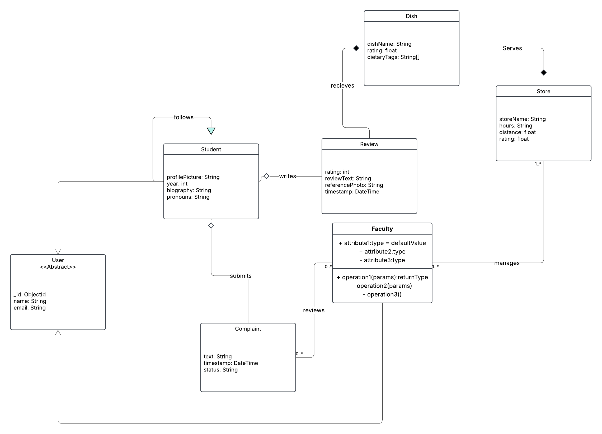
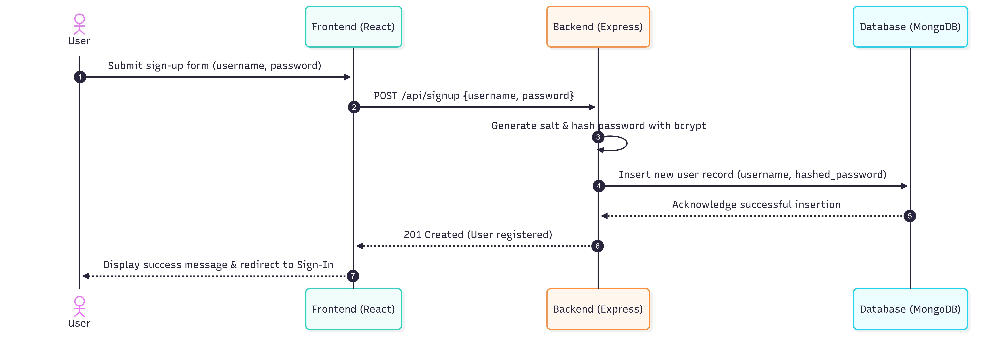
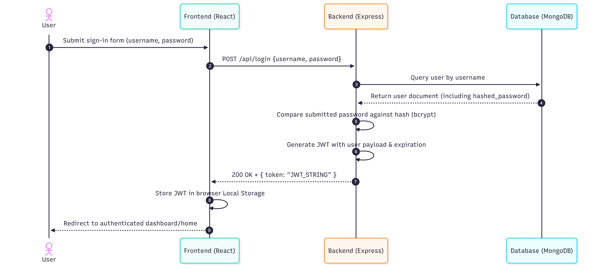
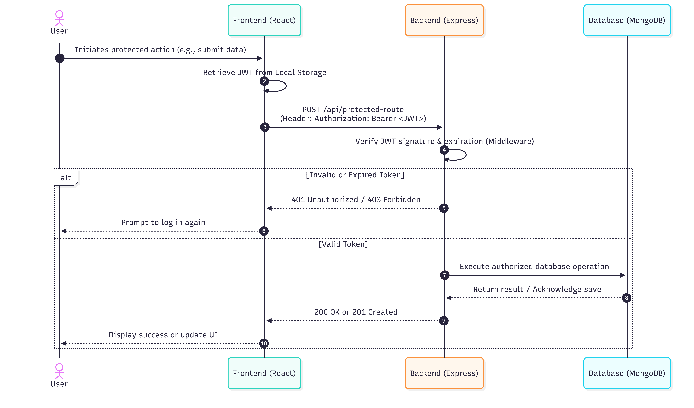

# Poly Rate My Food
## Rubber Duck - team 6 - CSC 307 team project

🌐 **Live Website:** https://zealous-grass-0d5be150f.4.azurestaticapps.net/

## Table of Contents

- [Product Vision](#product-vision)
- [UI Prototype](#ui-prototype)
- [Architecture Docs](#architecture-docs)
  - [Our Stack](#our-stack)
- [Development Environment Setup](#development-environment-setup)
- [Class (Data Model) Diagrams](#class-data-model-diagrams)
- [Signup Sequence Diagram](#signup-sequence-diagram)
- [Signin Sequence Diagram](#signin-sequence-diagram)
- [Endpoint Sequence Diagram](#endpoint-sequence-diagram)

## Product Vision
For Cal Poly students who utilize on-campus dining, Poly Rate My Food is a specialized rating platform that elevates the student dining experience and identifies the best campus dishes.

**Our product focuses on:**

- **Elevating Quality:** Providing honest, transparent data on popular dishes to help students avoid wasting money.

- **Data-Driven Choices:** Helping both students and faculty make informed decisions about food selection and menu planning for the week.

- **Bridging the Gap:** Creating a feedback loop where student discontent is transformed into actionable data for faculty to better allocate resources and improve options.

**Core Values:**

- **Transparency:** Providing a clear "Quality vs. Cost" metric so students know exactly what they are getting for their dining dollars.

- **Efficiency for Faculty:** Offering a "free data collection" method that replaces manual surveys with real-time student sentiment.

- **Community Recommendation:** Reducing the "overwhelming" feeling for students and the "lack of options" feeling for seniors by highlighting the best dishes across all spread-out dining halls.

## UI Prototype

We decided to use figma to create an interactive UI prototype. You can find our project through the link below!

[View Our Figma Prototype](https://www.figma.com/proto/OISdAr94PWu1oY6zqT3CjO/PRMF-wireframe?node-id=11-232&t=zIU9eh66fzXnfrG5-1&starting-point-node-id=11%3A232)

## Architecture Docs

**Our Stack**

**Frontend** : React, Mantine

**Backend** : Express, Mongoose 

**Database** : MongoDB

## Development Environment Setup

We adopted Prettier and ESLint in order to have a cohesive coding style and linting rules. This helped us save time and limit merge conflicts.

## Class (Data Model) Diagrams 

## Signup Sequence Diagram

## Signin Sequence Diagram

## Endpoint Sequence Diagram

